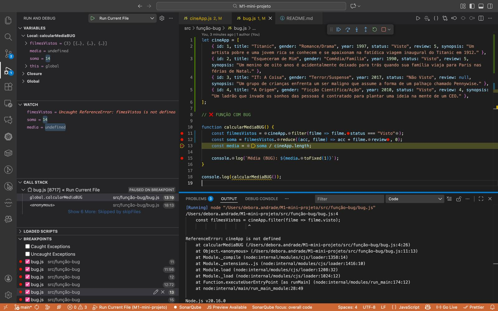
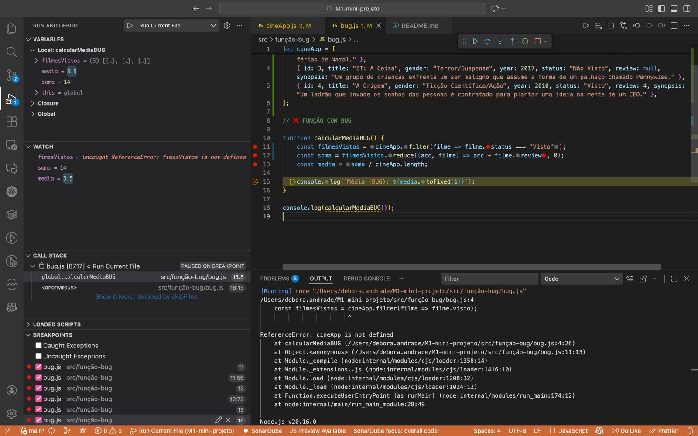
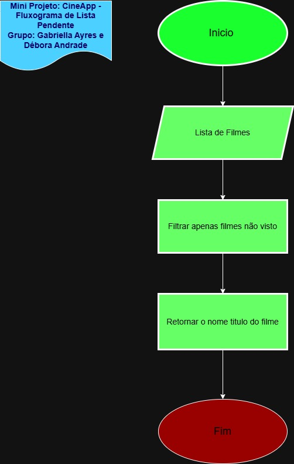
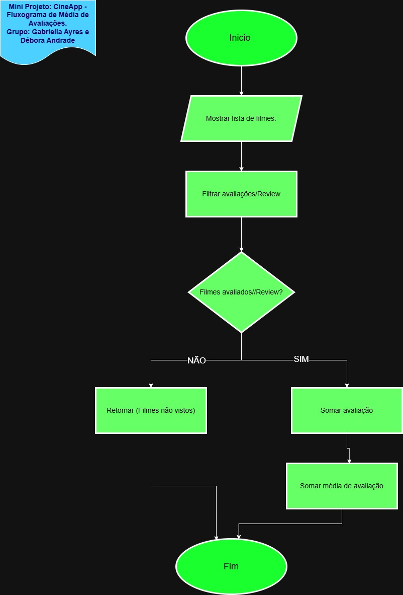

# 🎬 CineApp - A Tua Netflix Pessoal

### 👩‍💻 Autoras: Débora Andrade e Gabriella Ayres
- [Link Repositório-CineApp](https://github.com/DebsAndrade/CineApp)

## 🍿 O que é o CineApp?

Bem-vindo ao CineApp! Cansado de passar horas a fazer scroll no streaming sem saber o que ver? Nós resolvemos isso. Esta é uma aplicação feita à medida para gerir a tua coleção de filmes, registar o que já viste e, o mais importante, ajudar-te a decidir o filme de hoje à noite!
Este projeto foi desenvolvido em JavaScript no âmbito do nosso curso, combinando manipulação de Arrays, Objetos e lógica de programação. ❤️📽️

## 🚀 Funcionalidades Principais

A nossa aplicação gere duas grandes fontes de verdade: a Coleção de Filmes (Array de Objetos) e o Log de Atividades.

## Instruções de Execusão

### Pré-Requisito: Ferramentas

• Git;
• GitHub;
• Node.js;
• Visual Studio Code.

### Passos para Execução

1. Git clone:

> https://github.com/DebsAndrade/CineApp.git

2. Executar Node

> node cineApp.js

### ⚙️ Operações Básicas

• Adicionar Filme 📝: Insere novos objetos de filmes na coleção (com validação de IDs/títulos duplicados).
• Listar Pendentes ⏳: Filtra e exibe o array de filmes que ainda têm o estado "Não Visto".
• Marcar como Visto ✅: Altera a propriedade de estado do filme, atribui uma nota (0-5 ⭐️) e faz push da ação no Log.
• Remover Filme 🗑️: Remove permanentemente um filme do array através do seu ID (usando filter).
• Média de Avaliações 📈: Percorre os filmes vistos e calcula a média aritmética das notas.
• Contagem por Género 📊: Um contador inteligente que diz quantos filmes de "Terror" ou "Comédia" tens guardados.
• Recomendação Aleatória 🎲: Usa Math.random() para sugerir um filme pendente para a tua sessão de cinema!

### ✨ O Toque de Criatividade (3 Funcionalidades Extra)

Para ir além do básico, implementámos estas 3 operações exclusivas:
1. 🏆 O "Hall da Fama" (Top Rated):
• Filtra e lista apenas os filmes com nota 5. Só a nata do cinema!
2. 🔍 Busca Rápida (Filter/Includes):
• Pesquisa um filme pelo título (ou parte dele) usando métodos de string.
3. ⏱️ Edição de Titulo/Filme:
• Função para deixar mais interativo para o usuário. Deixando o nome do filme a sua escolha.

### 🕵️‍♀️ Caça ao Bug (Simulação)

Como parte do desafio académico, implementámos propositadamente um erro de lógica.

• Ao calcular a média dos filmes, a soma foi realizada com base no array original, em vez de utilizar a nova variável contendo o array atualizado de filmes vistos.

 

 

### Fluxograma

• Como parte do programa criamos fluxogramas para as operações abaixo:

1. Listar Pendentes:

2. Média de Avaliações:

